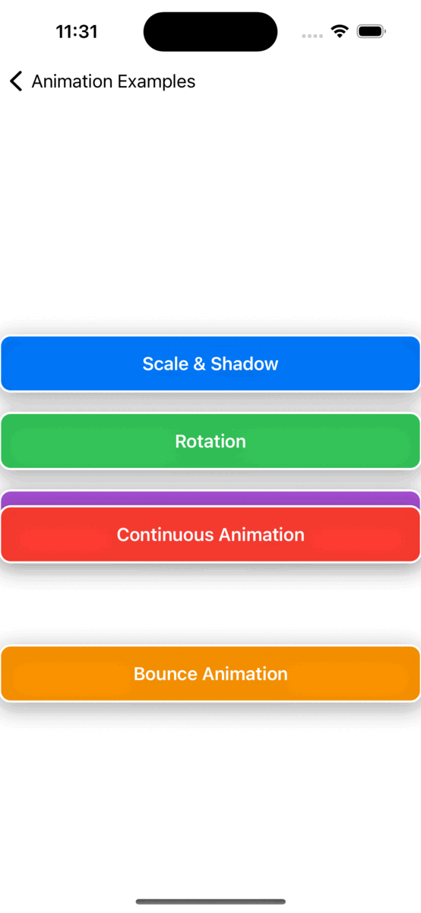
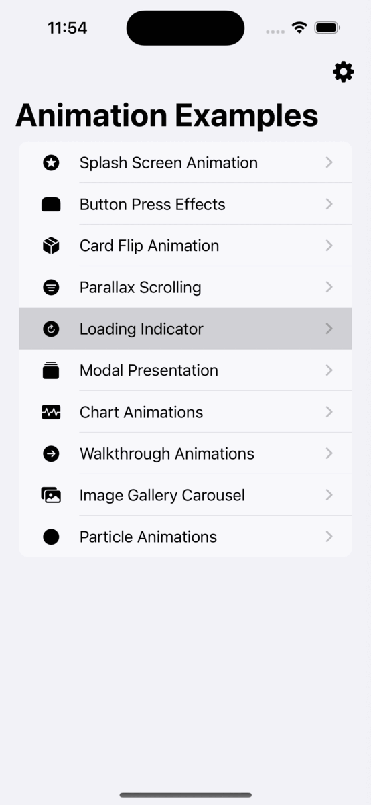
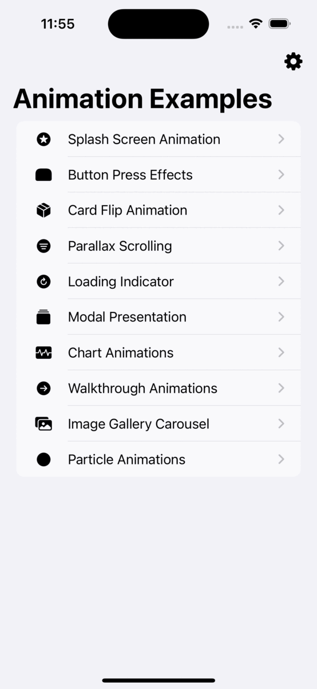
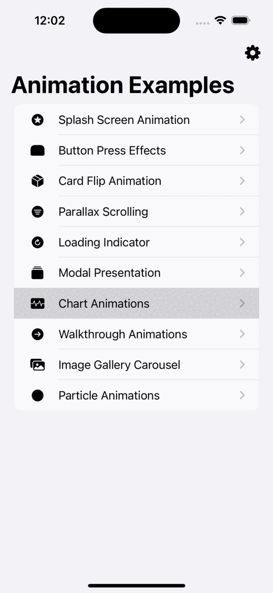
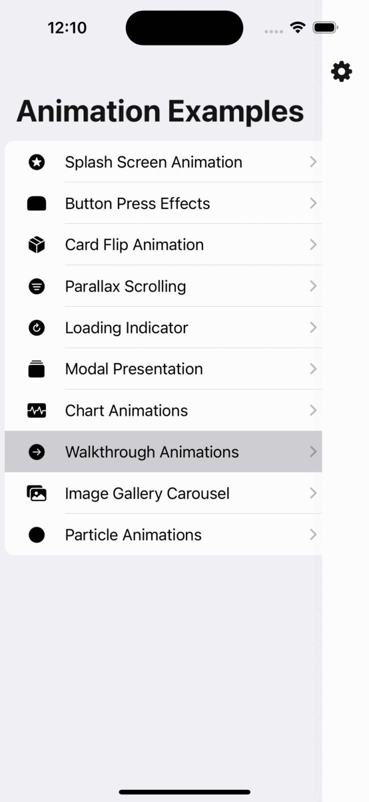
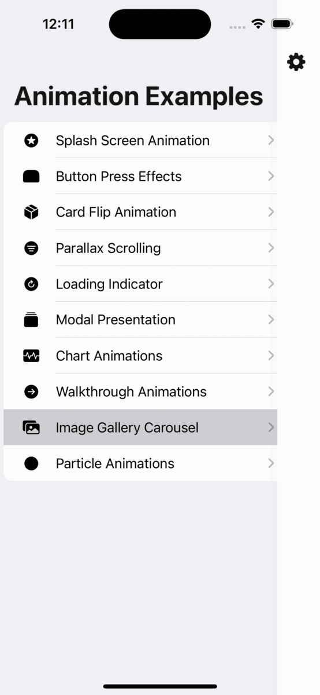
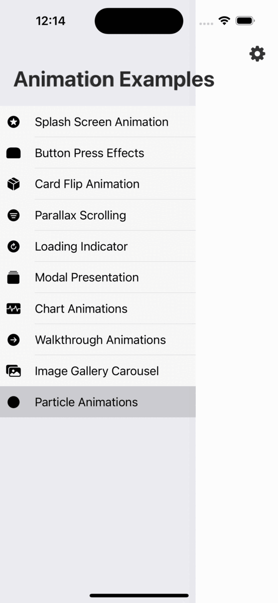

# SwiftUI- Animation Examples

This repository contains a collection of SwiftUI animation examples implemented by Gul Eda Aydemir.
> https://www.linkedin.com/in/gul-eda-aydemir/

  

## Table of Contents

- [Introduction](#introduction)
- [Animations](#animations)
  - [🔺 Splash Screen Animation](#-splash-screen-animation)
  - [🔺 Button Press Effects](#-button-press-effects)
  - [🔺 Card Flip Animation](#-card-flip-animation)
  - [🔺 Parallax Scrolling](#-parallax-scrolling)
  - [🔺 Loading Indicator](#-loading-indicator)
  - [🔺 Modal Presentation](#-modal-presentation)
  - [🔺 Chart Animations](#-chart-animations)
  - [🔺 Walkthrough Animations](#-walkthrough-animations)
  - [🔺 Image Gallery Carousel](#-image-gallery-carousel)
  - [🔺 Pulsating Circle Animations](#-pulsating-circle-animations)
- [Getting Started](#getting-started)
- [Contributing](#contributing)
- [License](#license)

## Introduction

This project showcases various animation techniques implemented using SwiftUI. Each animation example is contained in its own SwiftUI view, providing a practical demonstration of how animations can be used to create engaging and visually appealing user interfaces.

## Animations

### 🔺 Splash Screen Animation

This animation demonstrates a dynamic splash screen that transitions smoothly into the main content of the app.

### 🔺 Button Press Effects

Button press effects add visual feedback to user interactions, enhancing the overall user experience.

* **Scale & Shadow Effect:** The "Scale & Shadow" button scales down and applies a shadow effect when pressed. The button smoothly scales down and simultaneously adds a subtle shadow to mimic a pushed effect. When released, the button returns to its original size and shadow disappears.

* **Rotation Effect:** The "Rotation" button demonstrates a rotation animation effect. Upon pressing, the button smoothly rotates by 45 degrees using the .rotationEffect() modifier, adding a playful element to the interaction.

* **Press & Release Effect:** The "Press & Release" button showcases a scaling effect with shadow. When pressed, the button slightly scales down and adds a shadow to simulate depth. Upon release, the button returns to its original size and the shadow disappears.

* **Continuous Animation Effect:** The "Continuous Animation" button features a continuous scaling animation. It continuously alternates between full size and slightly smaller size, creating an engaging and dynamic effect.

* **Bounce Animation Effect:** The "Bounce Animation" button employs an interpolating spring animation. Upon pressing, the button scales down and then bounces back with a spring-like motion, providing a lively and interactive experience.

### 🔺 Card Flip Animation

The card flip animation showcases a classic flip effect, revealing the back of the card when tapped.

### 🔺 Parallax Scrolling

Parallax scrolling creates a captivating visual effect where background elements move at different speeds, providing depth to the user interface.

### 🔺 Loading Indicator

Loading indicators provide users with feedback during data loading or processing tasks.

### 🔺 Modal Presentation

Modal presentations overlay a new view on top of the current one, offering a focused context for specific actions or information.

### 🔺 Chart Animations

Animated charts bring data to life, making it easier for users to understand and interpret information.

### 🔺 Walkthrough Animations

Walkthrough animations guide users through a series of screens or steps, introducing app features or functionality.

### 🔺 Image Gallery Carousel

Image gallery carousels provide an interactive way to view and navigate through a collection of images.

### 🔺 Pulsating Circle Animations

Pulsating circle animations create dynamic and visually appealing effects using animated circles that change in size over time.

## Getting Started

To run the animation examples on your local machine, follow these steps:

1. Clone this repository to your local machine using `git clone https://github.com/guledaaydemir/SwiftUI-Animations`.
2. Open the Xcode project (`Animation.xcodeproj`) using Xcode.
3. Select a specific animation example from the project navigator on the left.
4. Build and run the example in the Xcode simulator.

## Contributing

<ol>
<li>Fork it!</li>
<li>Create your feature branch: git checkout -b my-new-feature</li>
<li>Commit your changes: git commit -am 'Add some feature'</li>
<li>Push to the branch: git push origin my-new-feature</li>
<li>Submit a pull request :D</li>
</ol>

## License

This project is licensed under the MIT License - see the [LICENSE](LICENSE) file for details.

📮 For more information contact me: guledaaydemir@gmail.com

